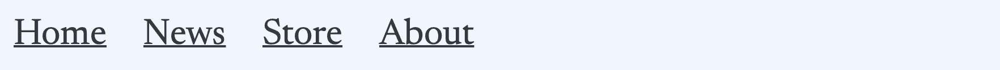
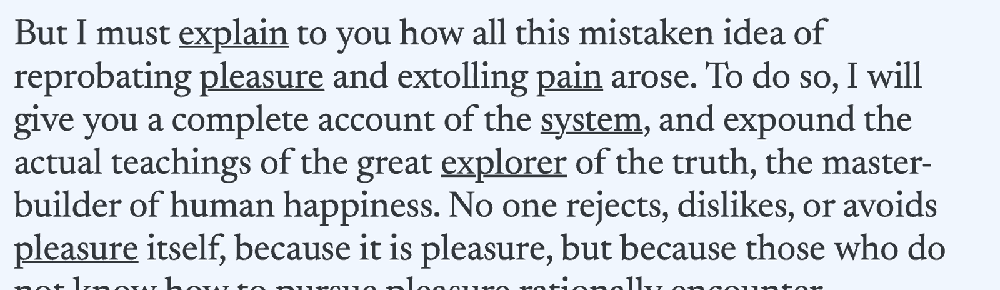
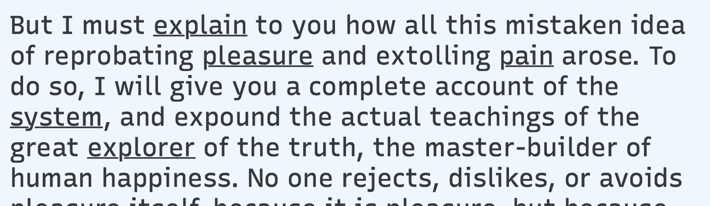
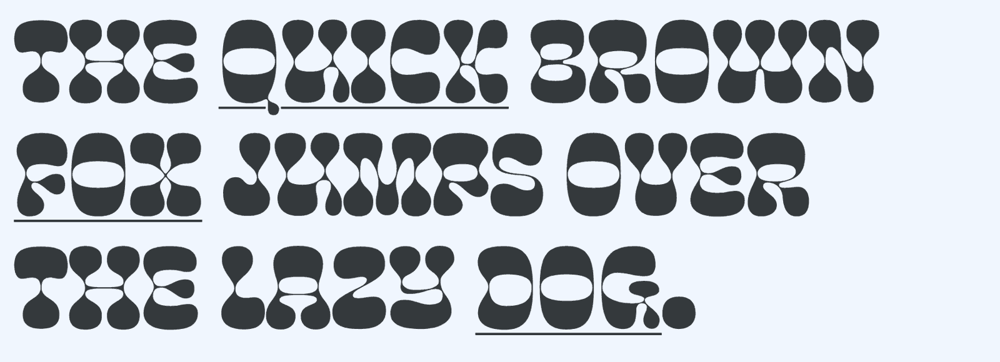
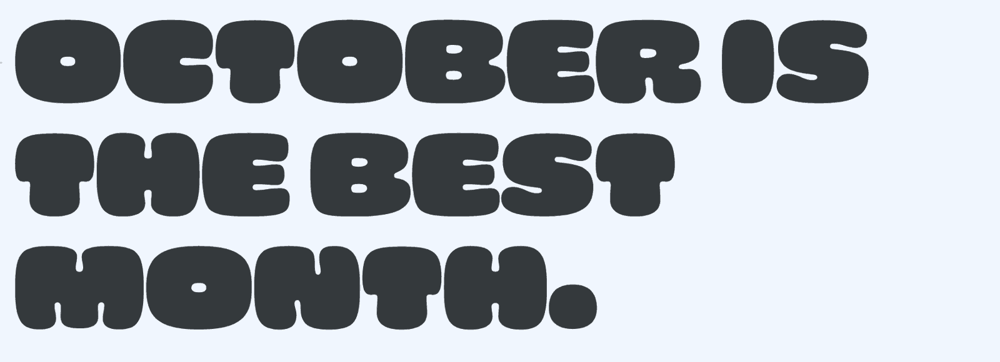

Variable fonts allow for seamless, fluid blending between stylistic variants, making them excellent candidates for simple, lightweight animations. Variable font animations can provide subtle effects for user interactions and visual semantics, or they can be used for more dramatic special effects.

## Simple Hover Effects

For a simple example of hover interaction, let’s consider hyperlinks that change weight on hover:

<figure>

</figure>
<figcaption>Basic weight change on hover. Typeface: <a href="https://fonts.google.com/specimen/Newsreader">Newsreader</a>.</figcaption>

The effect is rather sudden, switching between weights instantly on hover. With variable fonts, though, it’s possible smooth the effect using a simple transition:

<figure>

</figure>
<figcaption>Subtle hover animation with variable fonts.</figcaption>

Instead of jumping between static weights, the change is continuous. Just be careful not to make animations too long—even one-second animations can feel tedious for quick hover interactions.

It’s very common for bolder weights of a typeface to occupy more space, which causes subtle shifts in positioning. For menus and other small pieces of text, such shifts can be minimized by isolating elements from each other in separate fixed containers:

<figure>

</figure>
<figcaption>Hover animation with each element in separate fixed containers to prevent layout shift.</figcaption>

## Multiplexed Weight and Grades

For more demanding situations where shifts in positioning aren’t acceptable at all, you can use “[multiplexed](/glossary/multiplexed_duplexed_uniwidth)” fonts, designed specifically to occupy the same amount of space across a range of variants. When the Regular and Bold weights occupy the same amount of horizontal spacing, the hover effect feels more seamless. It is also crucial for use within paragraphs of body text where layout shifts would be too distracting otherwise.

<figure>

</figure>
<figcaption>Typeface: <a href="https://fonts.google.com/specimen/Newsreader">Newsreader</a>.</figcaption>

<figure>

</figure>
<figcaption>Multiplexed fonts prevent shifts in the layout by maintaining the same width requirements across variants. Typeface: <a href="https://fonts.google.com/specimen/Recursive">Recursive</a>.</figcaption>

On a related note, some variable fonts also offer a “[grade](/glossary/grade_axis)” axis separate from (and often in addition to) the standard [weight](/glossary/weight_axis) axis. This allows for multiplexed adjustments to a typeface’s apparent weight even if its standard weight axis would otherwise affect spacing.

Not all variable fonts offer multiplexed variations, but there is a [growing selection](https://v-fonts.com/tags/C9) available. And it’s worth noting that almost all [monospaced](/glossary/monospaced) variable fonts are naturally multiplexed.

## Multiplexing Beyond Weight

Multiplexing isn’t limited to just standard variations in weight or grades either. For example, some variable fonts have an adjustable [italic](/glossary/italic_axis) axis that doesn’t affect spacing. Other variable fonts may offer multiplexed variations that are much more unusual, allowing for more stylized special effects:

<figure>

</figure>
<figcaption>Multiplexed hover animations with variations other than standard weight. Typeface: Cheee Variable.</figcaption>

Finally, for other special interactive effects, keep in mind that `:hover` isn’t limited to just hyperlinks. For example, you can wrap arbitrary elements in their own `span` elements and use that for triggering hover effects. You can also tweak the timing of a transition to make it faster or slower:

<figure>

<figcaption>Multiplexed hover effects with more expressive variations, on a letter-by-letter basis. Typeface: Cheee Variable.</figcaption>

Interactivity is a virtually infinite space for experience design, and variable fonts offer that much more room for exploration. For more ideas on using variable fonts, see the [other articles listed under the topic of variable fonts](https://fonts.google.com/knowledge/topics/variable_fonts).
