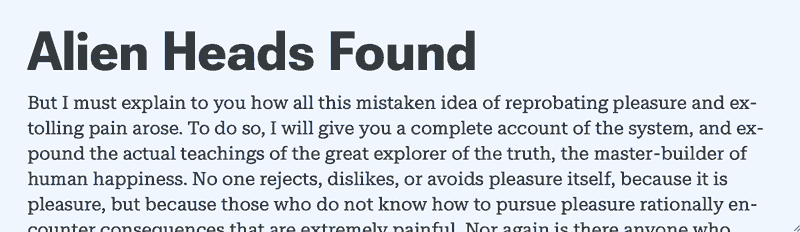
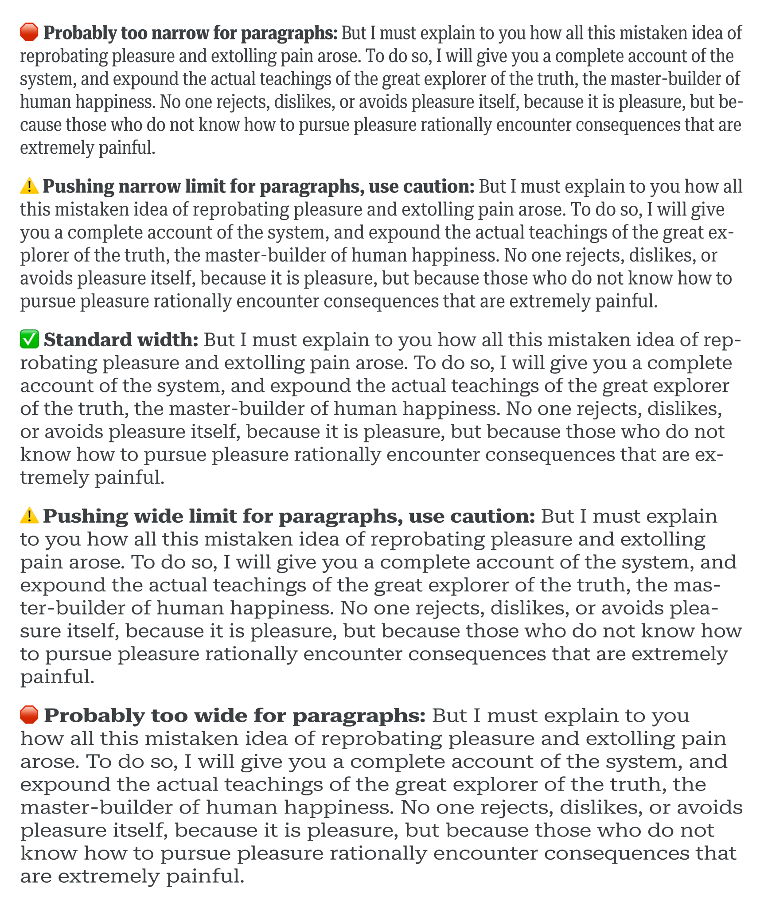

In addition to their [technical benefits](/lesson/web_font_comparisons_variable_vs_static), variable fonts offer much more flexibility for typesetting in both printed and digital media. This flexibility is especially beneficial in the context of responsive design where the presentation of content adapts to different formats and contexts.

The most common considerations for designing a responsive composition are tied to the availability of space. When space is limited (e.g. on small screens), the content’s presentation must be optimized accordingly—line lengths are constrained, whitespace is minimized, and the potential contrast in size between small and large elements is reduced. In these situations, even very small changes in formatting can provide significant improvements in readability and visual hierarchy.

Higher-level properties like `font-size`, `width`, `padding`, and `line-height` can be set to responsively adapt a typographic composition to differently-sized containers. One of the most common approaches for changing these values on a web page is to use CSS `@media` queries (or the more recent `@container` queries) to set breakpoints where the values of different properties change according to the available space.

<figure>

</figure>
<figcaption>Static fonts with a layout breakpoint: A single breakpoint changes padding, font sizes, and line-height.</figcaption>

A smoother and more seamless approach is to reduce the reliance on such queries, and instead try to make use of relative values that scale fluidly.

<figure>

</figure>
<figcaption>Static fonts with intrinsic layout: The widths of the fonts remain fixed, but padding, font sizes, and line-heights change more smoothly with relative units.</figcaption>

Variable fonts allow for seamless adaptation to extend even further down to the lowest-level details in the typeface. Typographic glyphs that would otherwise be fixed in traditional static fonts can now fluidly morph to better fit their containers.

## Width

The most obvious approach for optimizing a typeface’s spatial proportions is tied to a fairly common design axis in variable fonts: Width. Even small changes in the width of a typeface can allow for more characters per line, and thus more words per line and more even line breaks—especially when dealing with narrow [line lengths](/glossary/measure_line_length).

<figure>

</figure>
<figcaption>Breakpoint for static fonts with intrinsic layout: Now the font widths also change, but only at a single breakpoint.</figcaption>

Static typeface families that offer multiple widths sometimes have large differences between one width and the next, but variable fonts allow for intermediate variants so adjustments can be more fine-tuned and subtle.

<figure>

</figure>
<figcaption>Gradual variable font changes with intrinsic layout: Everything changes smoothly thanks to relative units and the fine-tuning flexibility of variable fonts.</figcaption>

(As of October 2022, the lack of support for [interpolated values and unit division](https://css.oddbird.net/rwd/interpolation/) in CSS means smooth control over variable font width still requires either a series of closely-spaced breakpoints to adjust the font variations incrementally, or a dash of JavaScript to help set font width values seamlessly with a single intrinsic formula. Tools like [Typetura](https://typetura.com) can be helpful for this kind of intrinsic control.)

Special care should be taken when adjusting the width of a typeface, particularly in the context of running body text. Extreme widths can adversely affect readability, negating other benefits in spatial efficiency.

<figure>

</figure>
<figcaption>Avoid extremely narrow or wide font variants for paragraph text, as they can harm readability when typesetting anything more than a few words at a time.</figcaption>

## Line-filling

Speaking of width, variable fonts with adjustable widths can be used to make different pieces of text fill their containers without changing the font size. Long words can be condensed to fill the same line length as short words without resorting to artificial transformations. (For a real-world example of this effect in use, see [the 2019 Typographics website](https://2019.typographics.com)). Options for achieving this automatically still require some JavaScript, but tools like [Font-To-Width](http://font-to-width.com) or [fit-to-width](https://github.com/Lorp/fit-to-width) can make it relatively easy.

<figure>

</figure>
<figcaption>Variable fonts can be automatically condensed or expanded to fit different pieces of text on the same line length without changing the font size or resorting to synthetic squooshing.</figcaption>

## Extenders

Another approach for optimizing the spatial efficiency of a typeface is related to the clearance needed for minimal [line space](/glossary/line_height_leading). This is typically limited by the distance the [cap height](/glossary/cap_height) and [ascenders/descenders](/glossary/ascenders_descenders) extend beyond the bounds of the [x-height](/glossary/x_height). Shorter extenders allow for a smaller line space by preventing glyphs from colliding between lines.

<figure>

</figure>
<figcaption>Fonts with retractable ascenders and descenders can be used to avoid collisions for tight line spacing.</figcaption>

Some typefaces address this by simply minimizing the length of extenders across the board. It may look slightly unusual in settings where a small line space isn’t needed, but it allows for tighter settings when needed.

A technique that is much less common is to use variable fonts with an axis for adjustable extenders. This means extenders can be shortened or lengthened only as much as needed. In a responsive context, this can happen in tandem with reductions to the line space and other properties.

<figure>

</figure>
<figcaption>Variable fonts allow for extenders that shrink or grow as space allows to prevent glyphs from colliding between lines.</figcaption>

(As with the adjustment to font widths mentioned above, this technique also requires the use of breakpoints or some minimal JavaScript.)

Those are just some examples of how you might want to harness the flexibility of variable fonts for various spatial optimizations. For more ideas on using variable fonts, see the [other articles listed under the topic of variable fonts](https://fonts.google.com/knowledge/topics/variable_fonts).
