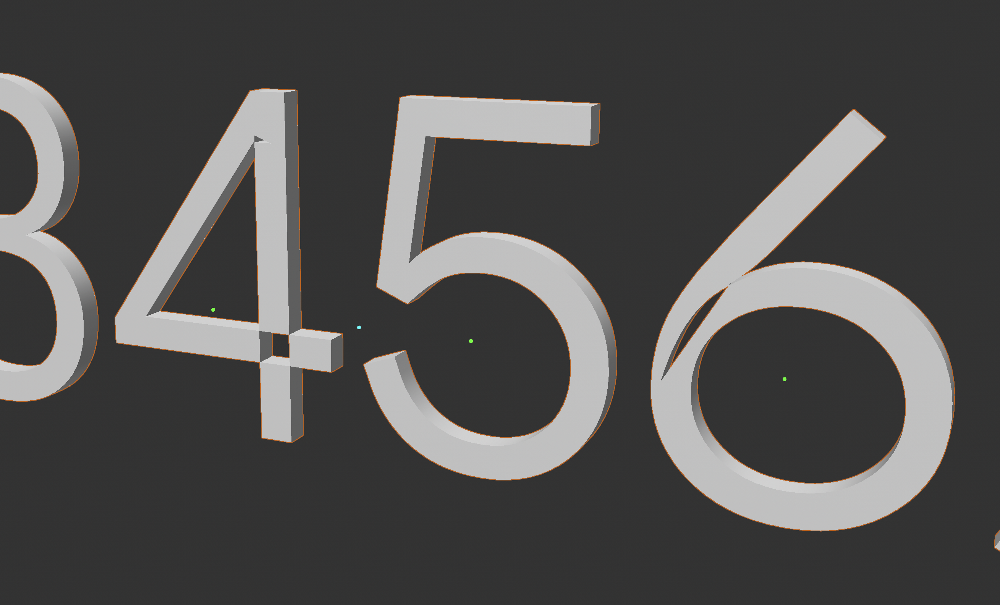

## Variable fonts are not supported at all

Variable font was introduced to the web in 2016, but some applications still do not offer any support for them.

To help with this situation, Google Fonts offers download ZIPs for each variable font family that include a set of commonly used static fonts.
But it is common that you will want to use a specific style that was not included.

There are several tools available to convert such an 'instance' into a static font, that will work everywhere:

* [Dinamo Font Gauntlet](https://fontgauntlet.com) 
* [Slice](https://slice-gui.netlify.app)

## Glyph outline overlaps causing holes

When variable fonts are supported, the most common technical problem encountered is with glyph outline contours that overlap.
When it occurs, the problem looks something like this:

<figure>

<figcaption>A variable font with glyphs B, P, R, e, and 4 that have contour overlaps, rendered in a 3D graphics editor incorrectly with holes.</figcaption>

</figure>

Here the glyphs in a 3D animation tool have contour overlaps, but they are rendered incorrectly, causing unwanted holes in the letterforms.

Sadly, this is not a problem with the font, but with the application. 
These overlaps are intrinsic to how variable fonts vary, and can not be removed from the font itself.
Many apps only offer the most basic support for variable fonts, and are not fully tested across all of their features by the developer.

This situation began in the early 1980s, when Adobe released its first font format.
At that time, Adobe specified that glyph outlines should not have contour overlaps. 
Over time, many apps have been built with an assumption that such overlaps do not occur. 
These apps offers text styling features, which add shadow, strokes, fills, and other treatments to text by processing the glyph outlines.
But when the overlaps are present, these processes give really weird output.

Fortunately, in all these apps, the workaround is always the same: 

**Apply a "Boolean union" function to remove the overlaps.** 

A Google search for ["boolean shape union APPNAME"](https://www.google.com/search?q=boolean+shape+union) should pull up the specifics for any app. 

A first preparatory step may also be needed, to ["convert text to outlines"](https://www.google.com/search?q=%22convert+text+to+outlines%22).

Applying a union operation often means turning "live text" into a "dead graphic", so that the text with a font choice to render the text with the font's glyphs, is converted to a set of graphic objects; the original text is lost, so editing the text requires recreating the graphic objects. 

3D and motion apps tends to have "node" or "pipeline" structured editing environments, where the union operation can be applied to live text as part of a multi-step process that also sets the extrusion depth, shadow, and other treatments of the text.
