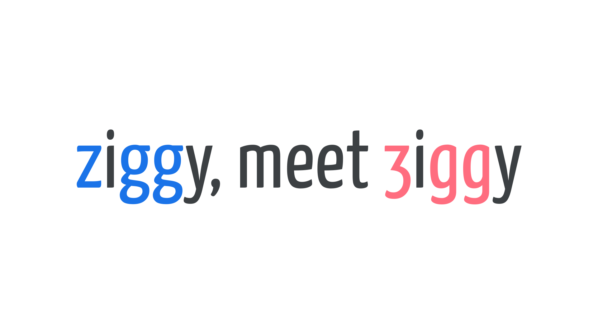

Alternates (also known as alternate [characters](/glossary/character) or alternate [glyphs](/glossary/glyph)) are substitute letterforms that supplement the default character set.

They usually serve one of two purposes:

1. To add variety to repeated characters (for example, you might use multiple alternate glyphs in text that’s meant to appear hand-lettered, or hand-distressed).
2. To account for the end user’s preference for different characteristics, such as the more unusual z and g glyphs in [Yanone Kaffeesatz](https://fonts.google.com/specimen/Yanone+Kaffeesatz).

<figure>

</figure>

Accessing alternates can be achieved via [OpenType](/glossary/open_type) either on a per-glyph level or by applying a [stylistic set](/glossary/stylistic_sets) to an entire piece of text. Contextual alternates, if enabled, can intelligently appear according to which glyphs they sit next to.
