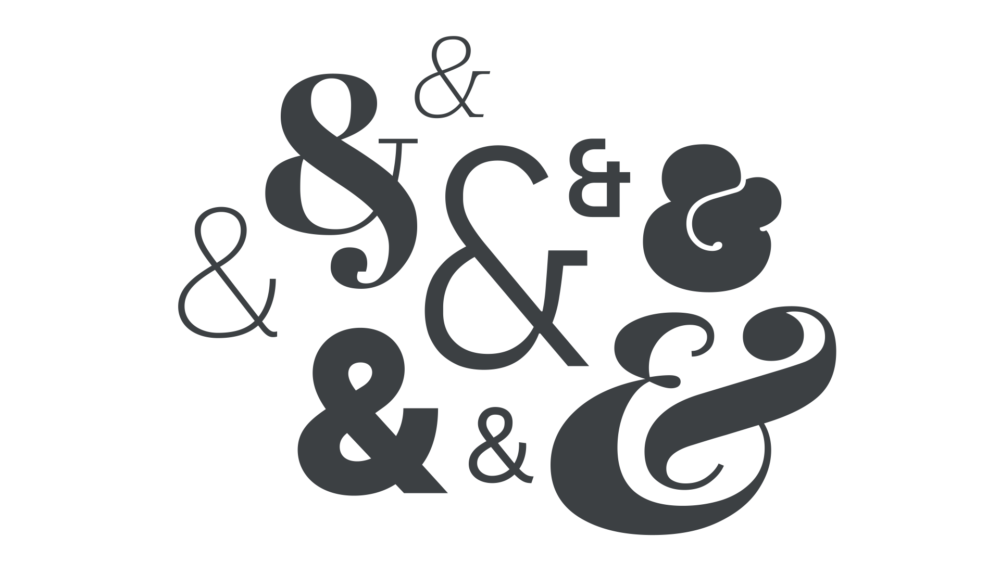

The ampersand character & means “and,” originally serving as a shorthand ligature for “et“ (the Latin word for “and”). Its name, first encountered in the 18th century, is derived from “and per se and”— although early use the character itself was recorded in the ruins of Pompeii (i.e., pre-79AD). “Et” was originally the 27th letter of the alphabet.

<figure>

</figure>

In titles, headings, logos, casual usage, and just to save space, it can be preferable to use an ampersand rather than writing “and." However, it’s best not to use ampersands in body text unless our style guide specifically allows for this.
