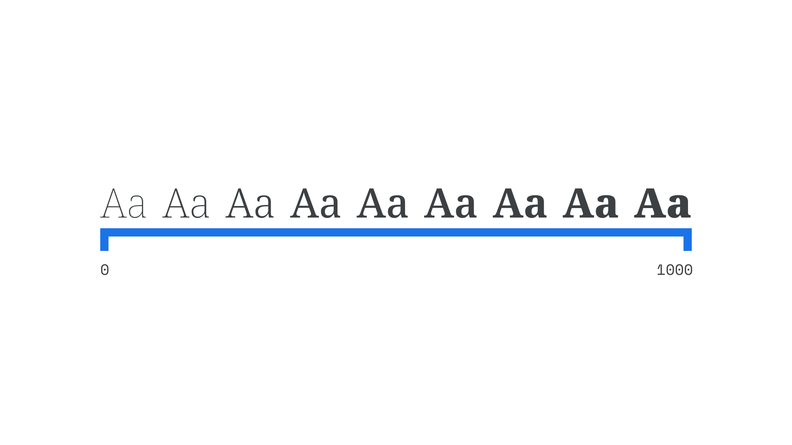

In [variable fonts](/glossary/variable_fonts), the axis usually refers to a single aspect of a [typeface](/glossary/typeface)’s design that can be altered by the user.

<figure>

</figure>

Common axes include [italic](/glossary/italic), [optical size](/glossary/optical_sizes), [slant](/glossary/oblique), [weight](/glossary/weight), [width](/glossary/width), and these five are registered (defined) in the OpenType file format specification. However, any property of a typeface’s design can be mapped to an axis—the choice is up to the [type designer](/glossary/type_designer). Using axes is possible in CSS via the `font-variation-settings` attribute.
