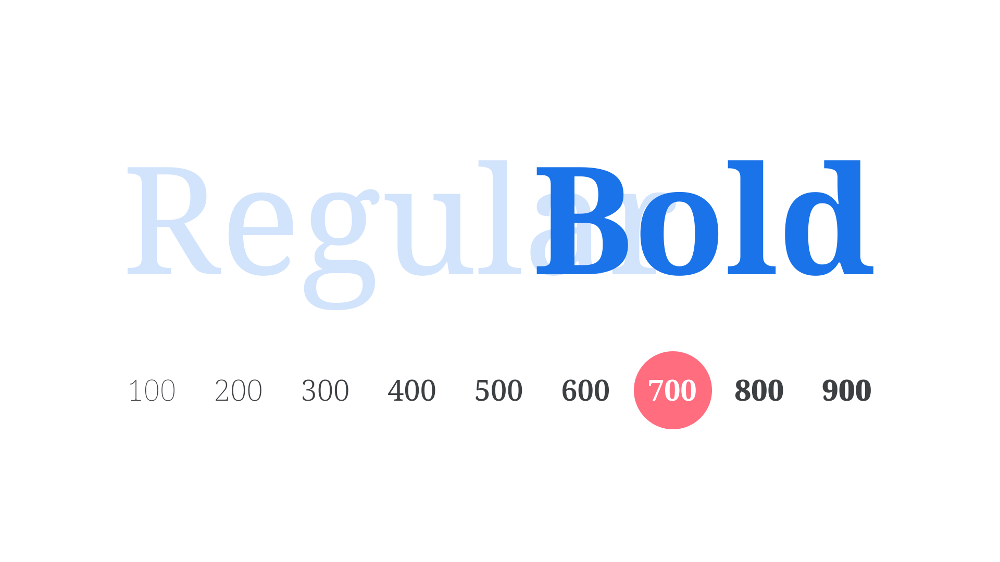

Bold is one of the most common [weights](/glossary/weight) of a [typeface](/glossary/typeface), always with a heavier [stroke](/glossary/stroke) than the [regular/upright](/glossary/regular_upright) version. Bold is commonly used for emphasis.

<figure>

</figure>

Exactly *how* much heavier than the weight that precedes it (usually Regular, but possibly Medium), and exactly how much lighter than the weight that follows (usually Extra Bold or Black) is arbitrary, and down to the discretion of the [type designer](/glossary/type_designer). The weight [axis](/glossary/axis_in_variable_fonts) of [variable fonts](/glossary/variable_fonts) puts more of this control into the hands of the end user, but, in CSS, Bold has the `font-weight` value of 700.
