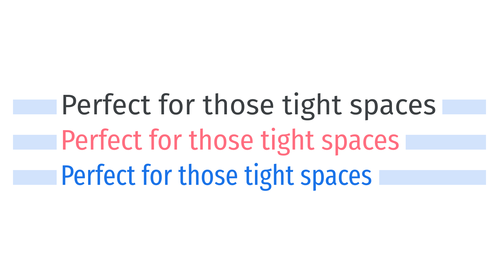

In [type](/glossary/type) design, condensed and narrow are references to the [typeface](/glossary/typeface)’s width, usually implying narrower versions of its normal width. Compressed faces are typically even *more* condensed, and often form part of a [family](/glossary/family_or_type_family_or_font_family) or [superfamily](/glossary/superfamily) that already has a condensed option.

<figure>

</figure>

These narrow-width faces are not merely scaled horizontally—they’re redrawn so that proportions and angles are reshaped relative to the original design without causing distortion to the letterforms (in contrast to type that is [artificially compressed by software](/glossary/faux_fake_pseudo_synthesized). They sit at the opposite end of the width scale to [“wide” or “extended” types](/glossary/wide_extended).
