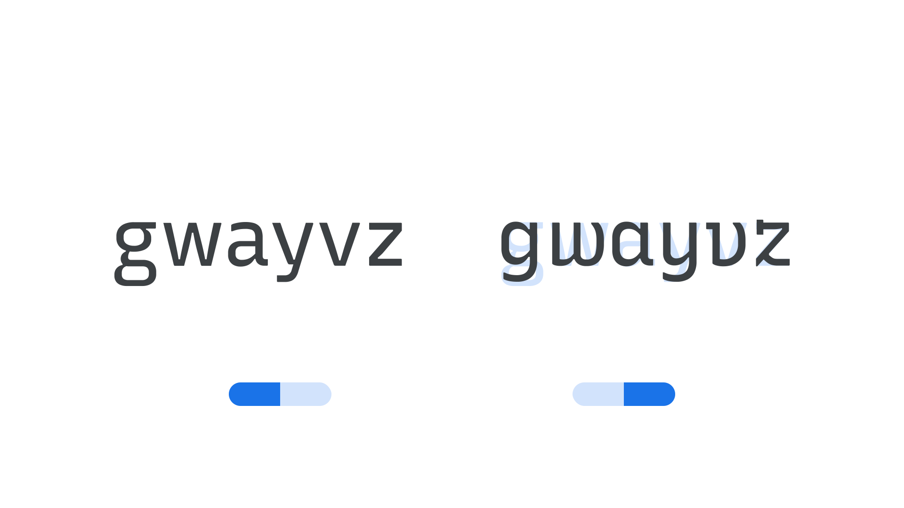

“Cursive” (CRSV in CSS)  is an axis found in some variable fonts, and controls the substitution of cursive forms. “Off” (0) maintains upright letterforms such as a double-storey a and g, “auto” (0.5) allows for cursive substitution of cursive forms when combined with the slant axis, and “on” (1) asserts cursive forms even in upright text with a slant of 0.
The Google Fonts CSS v2 API defines the axis as:

Default: 0.5     Min: 0     Max: 1     Step: 0.1

<figure>

<figcaption>CAPTION</figcaption>

</figure>

In line with the current CSS spec, all custom axes should be referenced in UPPERCASE (only the officially registered variable axes should appear in lowercase). Also, when using the Google Fonts API, the uppercase axes have to appear first in the URL.
