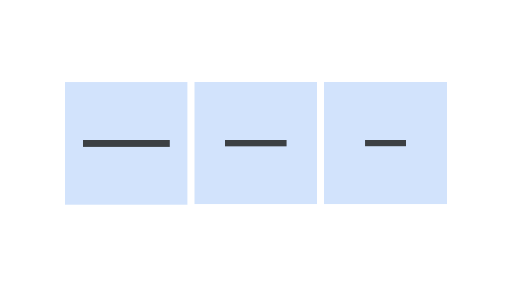

Dashes are a group of [characters](/glossary/character) that all take the form of horizontal bars, but are differentiated by the width of the bar itself.

The three most common dashes are the hyphen, the [en](/glossary/en) dash, and the [em](/glossary/em) dash. The hyphen is the narrowest; the en dash typically takes up half the width of the em square; and the em dash typically takes up typically the full width of an em square.

<figure>

</figure>

Hyphens are used to connect words, en dashes are (usually) used to indicate ranges (depending on the rules dictated by the style guide), and em dashes represent connections (or pauses) in thought. The use of [spaces](/glossary/spaces) around each type of dash should be consistent and dictated by the style guide.
