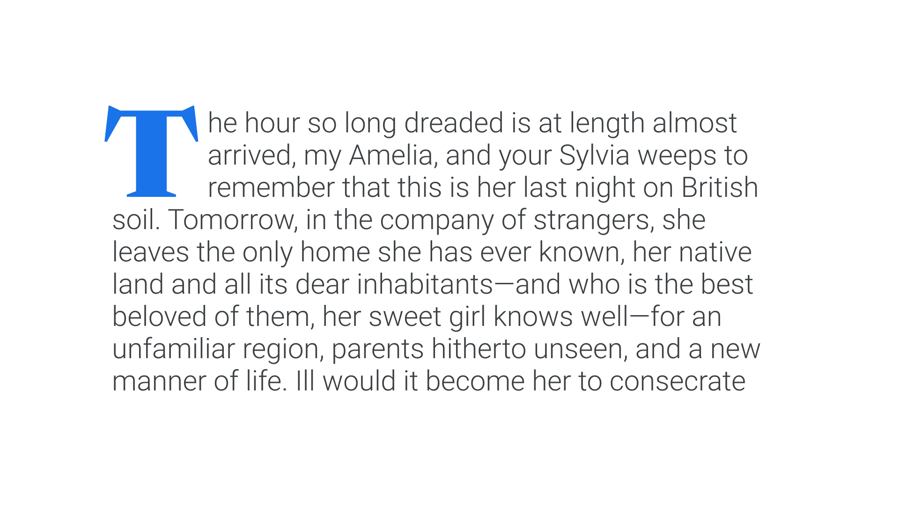

A drop cap is a large, [uppercase](/glossary/uppercase_lowercase) letter used for decoration in the opening of a piece (or section) of [text](/glossary/text), most often employed in editorial scenarios. It’s a direct descendant of the “illuminated” initials that originated in hand-lettered (pre-[type](/glossary/type)) bibles.

<figure>

</figure>

When [typesetting](/glossary/typesetting) drop caps, the [font](/glossary/font) size of the drop cap is often dictated by its alignment to the [baseline](/glossary/baseline) grid; a harmonious setting will have the [character](/glossary/character) effectively taking up the space of two, three, four, or even five lines of paragraph text.
