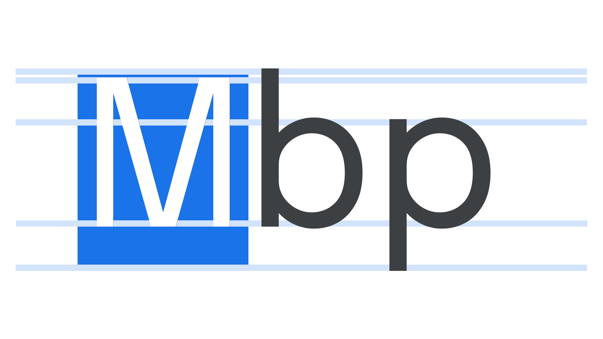

The em is a unit of measurement based on the width of the capital M in a particular [typeface](/glossary/typeface). The em square is the “box” that each [glyph](/glossary/glyph) is sized relative to. So, at 12 points, the em square is 12 points wide.

<figure>

</figure>

The em [dash](/glossary/dashes) is named because its width is, in theory, one em, although in many [fonts](/glossary/font) they are somewhat narrower. An [en](/glossary/en) dash takes up approximately half the space of an em square.

<figure>

</figure>

An em itself is a [unit](/glossary/unit) of measurement, relative to the size of the font; therefore, in a typeface set at a `font-size` of 16px, one em is 16px.
