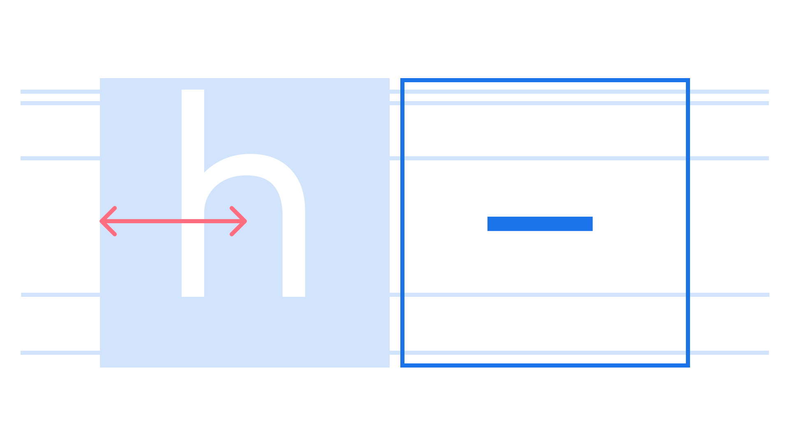

An en is a unit of measurement in [typography](/glossary/typography) based on half the width of the capital M in a particular [typeface](/glossary/typography) (one en = half an [em](/glossary/em)). The en [dash](/glossary/dashes) is a dash with a width that takes up approximately half the width of an em square.

<figure>

</figure>

An en itself is a [unit](/glossary/unit) of measurement, relative to the size of the [font](/glossary/font); therefore, in a typeface set at a `font-size` of 16px, one en is 8px.
