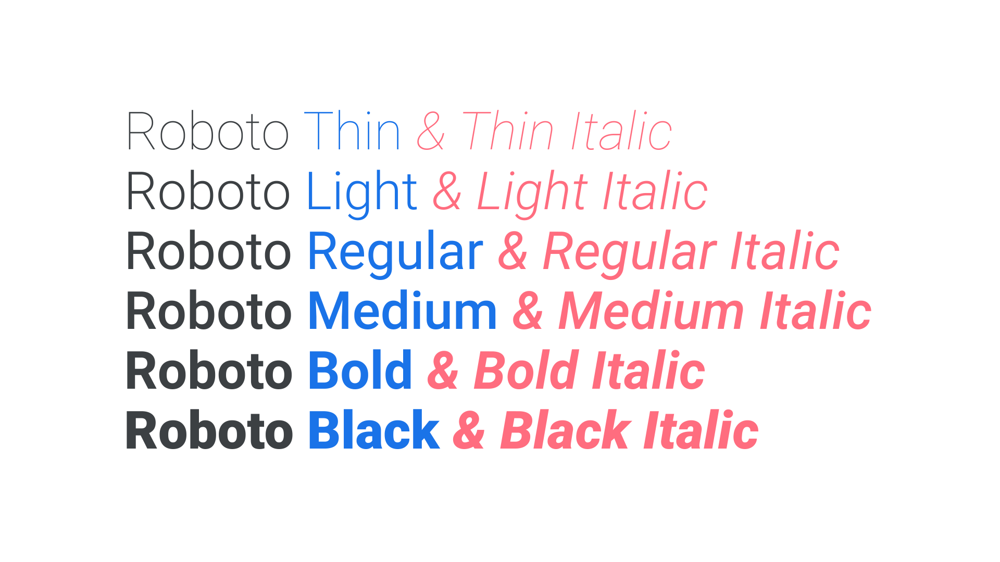

If we consider a [typeface](/glossary/typeface) to be the core design, then the different [weights](/glossary/weight) and [styles](/glossary/style) could be said to be instances of that design, and together they form a family (or type family, or font family).

Although we’re always keen to explain the seemingly subtle difference between a typeface (the thing you see) and a [font](/glossary/font) (the thing you use), “font family” is a valid term because each variation is indeed a font.

<figure>

</figure>

Most families include [Regular](/glossary/regular_upright), [Italic](/glossary/italic), [Bold](/glossary/bold), and Bold Italic fonts; however, the most robust families will include weights that vary from the very light (e.g. Hairline) to the very heavy (e.g. Ultra), and everything in between. With [variable fonts](/glossary/variable_fonts), the traditional notion of the family becomes less relevant, because those weights and styles are baked right into the core font file itself.

When there are [serif](/glossary/serif) and [sans serif](/glossary/sans_serif) (or [slab serif](/glossary/slab_serif_egyptian_clarendon), or [monospaced](/glossary/monospaced), etc.) versions of a typeface, they’re often collectively referred to as a [superfamily](/glossary/superfamily).