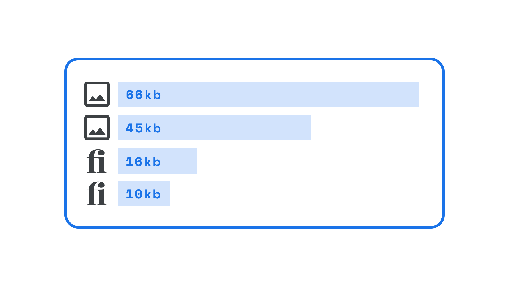

[Web fonts](/glossary/web_font), just like all website assets, are resources that need downloading to a user’s computer when they view a website; therefore, just as page loading times are affected by the file size of images used on a website, they're also affected by the size of the [font](/glossary/font) files.

<figure>

</figure>

At the simplest level, this is a valid argument for using only a small number of [typefaces](/glossary/typeface) in our designs, but also it means limiting the number of [weights](/glossary/weight) and [styles](/glossary/style) used on the site to save on file size.

This is a core advantage of [variable fonts](/glossary/variable_fonts): If we’re using multiple weights and styles (i.e., more than the “usual” Regular, Italic, Bold, and Bold Italic), all of them are contained in one file—and that file is almost always considerably smaller than downloading individual font files. Plus, there's virtually no limit to the number of discreet styles we can use with variable fonts. This allows for a much richer typographic experience.
