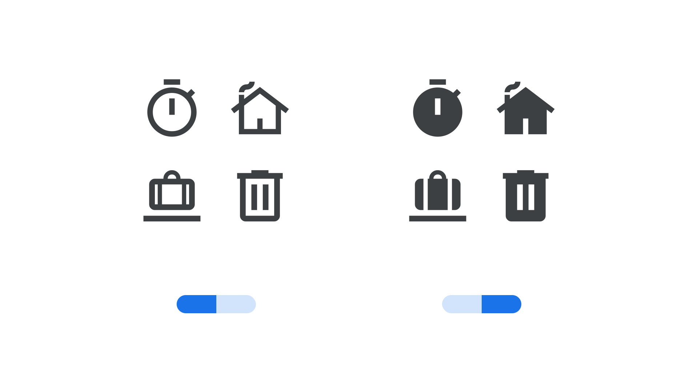

“Fill” (FILL in CSS) is an axis found in some variable fonts, intended to provide a treatment of the design that fills in transparent forms with opaque ones (and sometimes interior opaque forms become transparent, to maintain contrasting shapes). Transitions often occur from the center, a side, or a corner, but can go in any direction. This can be useful in animation or interaction to convey a state transition. The numbers indicate proportion filled, from 0 (no treatment) to 1 (completely filled).

The [Google Fonts CSS v2 API ](https://developers.google.com/fonts/docs/css2) defines the axis as:

Default: 0     Min: 0     Max: 1     Step: 0.01

This is currently implemented in Google’s Material icons:

<figure>

<figcaption>CAPTION</figcaption>

</figure>

In line with the current CSS spec, all custom axes should be referenced in UPPERCASE (only the officially registered variable axes should appear in lowercase). Also, when using the Google Fonts API, the uppercase axes have to appear first in the URL.
