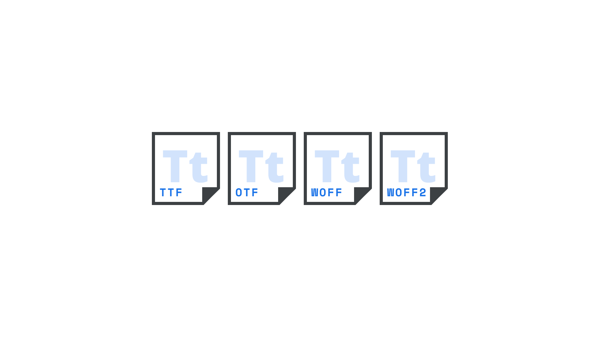

A [font](/glossary/font) format is a specific file type(s) designated to hold font data, with a font itself being the manifestation of a [typeface](/glossary/typeface). In other words, for a typeface to be used, it first has to exist as a font.

<figure>

</figure>

OpenType is the standard font format in common use. There are two subformats: TrueType (with the extension of .ttf) and CFF (.otf). Both can be [variable](/glossary/variable_fonts) (although for CFF, only in CFF v2). Both can be converted losslessly (using free tools) into [web fonts](/glossary/web_font); i.e., WOFF (Web Open Font Format, .woff) or WOFF2 (Web Open Font Format v2, .woff2). The WOFF and WOFF2 formats are widely supported in browsers.
