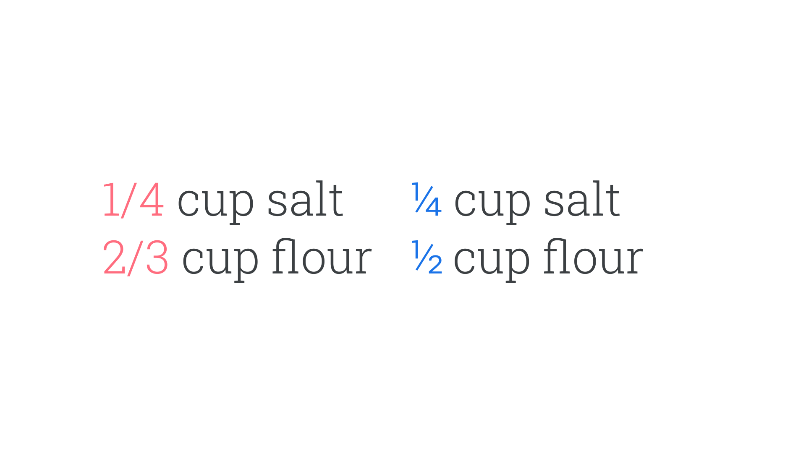

When referencing “fractions” in typographic terms, we’re usually referring to the [glyphs](/glossary/glyph) in any given [typeface](/glossary/typeface) that are dedicated to the optimal rendering of the mathematical fractions themselves.

<figure>

</figure>

Fractions are much more legible when rendered correctly as symbols—e.g. “3⁄4”—rather than written out in regular numerals—e.g. “3/4”—so it’s desirable to enable this correct rendering via [OpenType](/glossary/open_type).

Even without OpenType, many fonts have [Unicode](/glossary/unicode) points for the common fractions: ½, ¼, and ¾. Less-common fractions—⅓, ⅔, ⅛, ⅜, ⅜, ⅝, and ⅞—are not present in most fonts.
