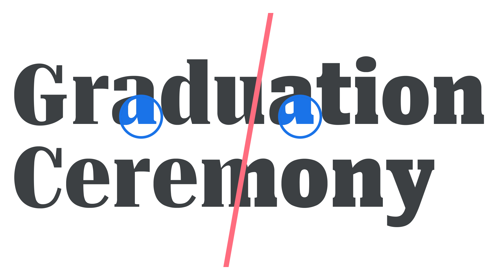

Originally conceived for printed newspapers to calibrate output from different presses, or different paper stocks, grade is an attempt to keep type appearing consistent across different media, or in certain contexts. Think of a newspaper (matte paper; more ink bleed) that also has a magazine-style weekend supplement (glossy paper; less ink bleed). This is a perfect use case for using different grades to achieve identical typographic color for the body text in both instances.

Unlike weight, which usually has an effect on width as well, grade alters only the thickness of the letterforms’ strokes without changing the width of the glyph. Although grade can alter contrast, it differs from optical sizing because its purpose is to compensate for differences in appearance and bring it back towards the intended design.

For screen reading, reversed (white on black or other light colors on dark background) type appears bolder than normal dark text on a light background. With printed text, the opposite is true (although the amount depends on the quality of the paper, as noted). In either case, a slight adjustment via grade can maintain the same visual effect.

<figure>

<figcaption>CAPTION</figcaption>

</figure>

In variable fonts, the grade axis allows for a level of granular control to create the optimal reading experience.
