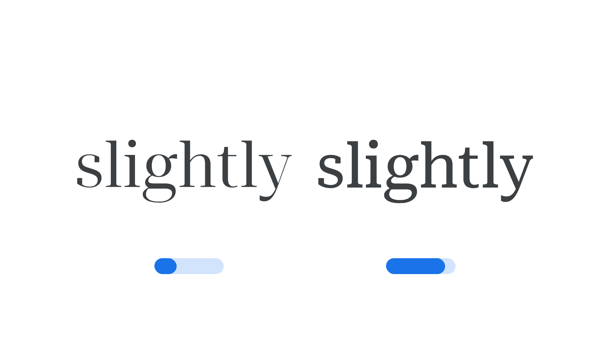

“Grade” (`GRAD` in CSS) is an [axis](/glossary/axis_in_variable_fonts) found in some [variable fonts](/glossary/variable_fonts). Changing [grade](INSERT_URL) allows us to finesse the style from lighter to heavier in typographic [color](INSERT_URL) by varying [stroke](INSERT_URL) thicknesses (or other forms) without any changes to the [type](INSERT_URL)’s overall [width](INSERT_URL), inter-letter spacing, or [kerning](INSERT_URL)—unlike altering [weight](INSERT_URL). This means there are no changes to line breaks or page layout.

The [Google Fonts CSS v2 API ](https://developers.google.com/fonts/docs/css2) defines the axis as:

| Default: 0 | Min: -1000 | Max: 1000 | Step: 1 |

Negative grade makes the style lighter, while positive grade makes it heavier. The units are the same as in the weight (`wght`) axis.

<figure>

<figcaption>CAPTION</figcaption>

</figure>

In line with the current CSS spec, all custom axes should be referenced in UPPERCASE (only the officially registered variable axes should appear in lowercase). Also, when using the Google Fonts API, the uppercase axes have to appear first in the URL.
