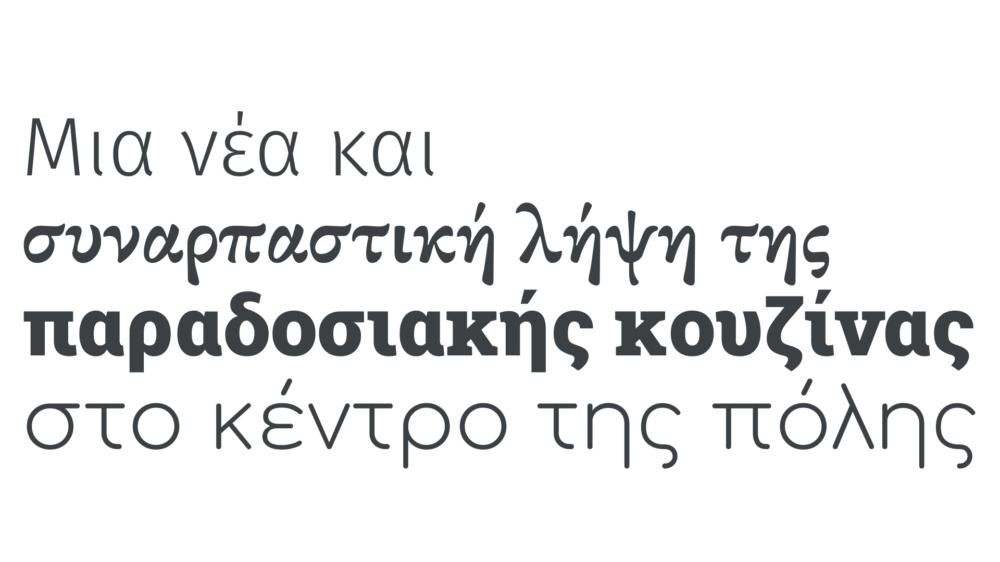

Greek script is the writing system used for the Greek language. It should not be confused with the erroneously used “Greek” placeholder text.

<figure>

<figcaption>CAPTION</figcaption>

</figure>

The first typefaces for the Greek script appeared in the 15th century. The lowercase letters closely followed key scribal hands of the period, while the capitals retained their inscriptional roots. Over time Greek typefaces evolved to maintain elements of their cursive roots in the lowercase, while developing a wider range of typographically appropriate forms.

The original Cyrillic script was based on uppercase Greek letterforms.

