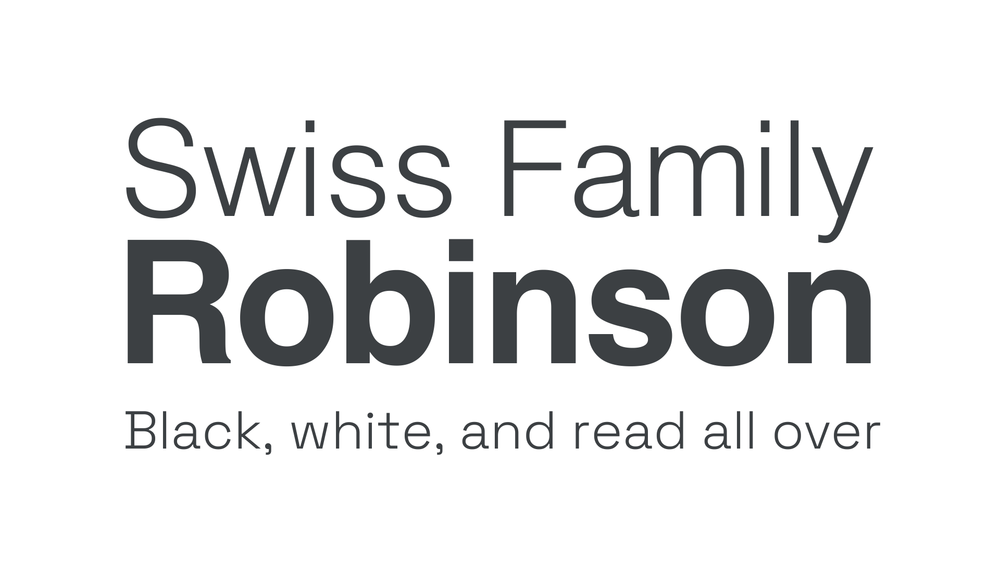

Grotesque was the first form of [sans serif](/glossary/sans_serif) [type](/glossary/type). It appeared in the early 19th Century, and had a somewhat irregular and awkward form (hence the name). The more refined evolution of this style, popular in the mid 20th century, became known as Neo-grotesque.

<figure>

</figure>

Examples of Neo-grotesque typefaces include [Space Grotesk](https://fonts.google.com/specimen/Space+Grotesk) and [Work Sans](https://fonts.google.com/specimen/Work+Sans).

However, it’s important to note that—like any historical [classification](/glossary/classification)—Grotesque typefaces that fit this style don’t necessarily come from this period in history.
