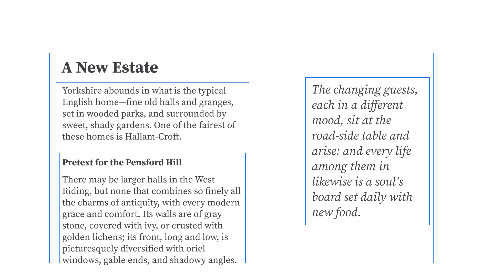

Hierarchy refers to the overall structure of a document and the relationship between elements within the [text](/glossary/text). A heading placed above a paragraph gives meaning and context to that paragraph, and implies a hierarchy to the text as a whole. Different levels of headings (in HTML, `h1`, `h2`, `h3`, etc.) further delineate hierarchy within sections of the text.

<figure>

</figure>

As [typographers](/glossary/typographer), our role is to further enhance the meaning and understanding of a text’s hierarchy by applying suitable [typographic treatments](/glossary/typography) to each element.
