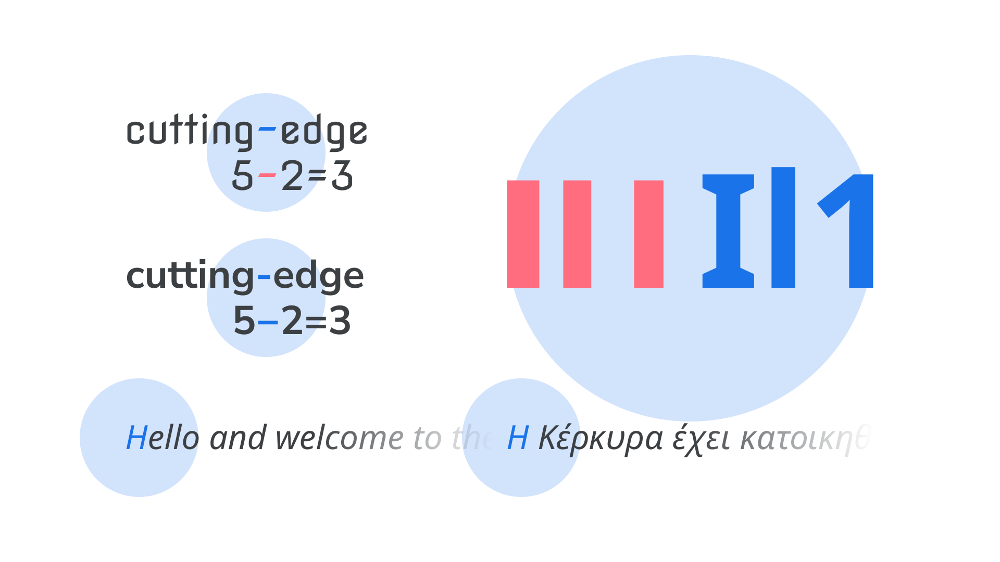

A homoglyph is a [glyph](INSERT_URL) with a design that can appear indistinguishable from—or least very similar to—another glyph with a separate meaning.

An uppercase I, lowercase l, and numeral 1 can appear near-identical in some typefaces, which presents a [legibility](INSERT_URL) problem. If the wrong character is used, it can confuse screen reading software and cause potential issues with searching and sorting. In some typefaces, there can be too subtle a distinction between different [dashes](INSERT_URL) and the minus [character](INSERT_URL).

<figure>

<figcaption>CAPTION</figcaption>

</figure>

Homoglyphs also manifest themselves across different languages and/or scripts. An “H” glyph in English is not the same, semantically, as the lookalike “H” glyph (for the “eta” character) in [Greek](INSERT_URL), for instance. This isn’t a problem in print, but is an issue for any on-screen type, which is subject to being copied and pasted, and read aloud by screen reading software.

Max Halford has written more on this topic on [Homoglyphs: different characters that look identical](https://maxhalford.github.io/blog/homoglyphs/).
