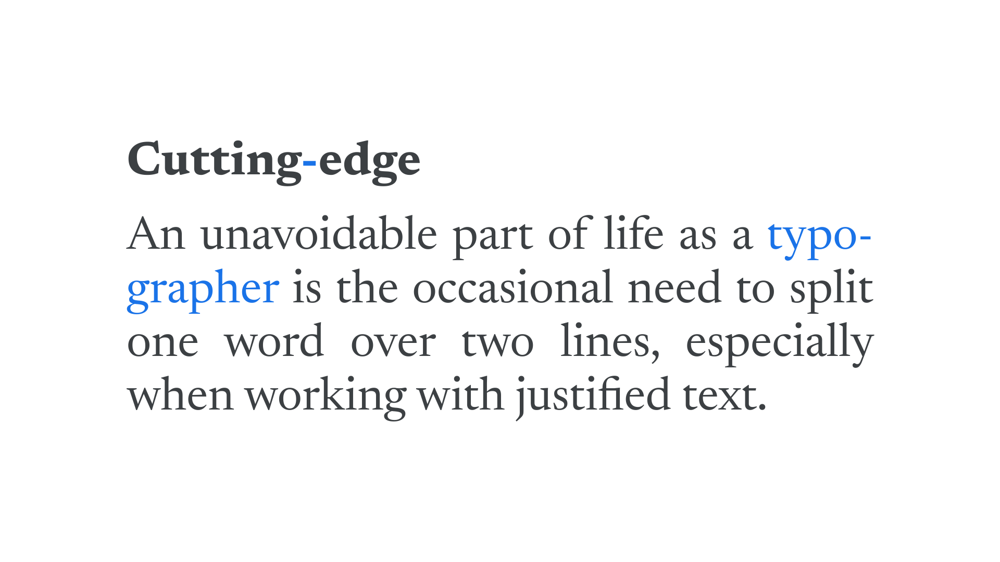

Hyphenation is the act of using the [hyphen](/glossary/dashes) [character](/glossary/character) to either break single words over two lines, or connect multiple words. The former is the job of the [typographer](/glossary/typographer) (usually aided by automatic tools built into design software or browsers); the latter is the job of the writer or editor.

<figure>


<figcaption>“Cutting-edge” is connected with a hyphen; “typographer” is split over two lines with a hyphen.</figcaption>

</figure>

When it comes to *breaking* words across lines, hyphenation is an essential part of any [justified text](/glossary/alignment_justification), since it can be difficult to balance lines of text that are aligned to both and left and right margins without breaking longer words with hyphenation.

Using a hyphen to *connect* separate words can be contentious, so it’s always best to refer to the style guide we’re using. Generally, they can be used to create compound modifiers:

```
Is this a dog-friendly park?
```

Or compound words:

```
Sister-in-law
```

There is no situation in which using a double hyphen is acceptable. If tempted, use an [en dash or em dash](/glossary/dashes) instead, and be sure to refer to the style guide.

Writing for the web and need guidance? Check out [the Material IO Guidelines](https://material.io/design/communication/writing.html).
