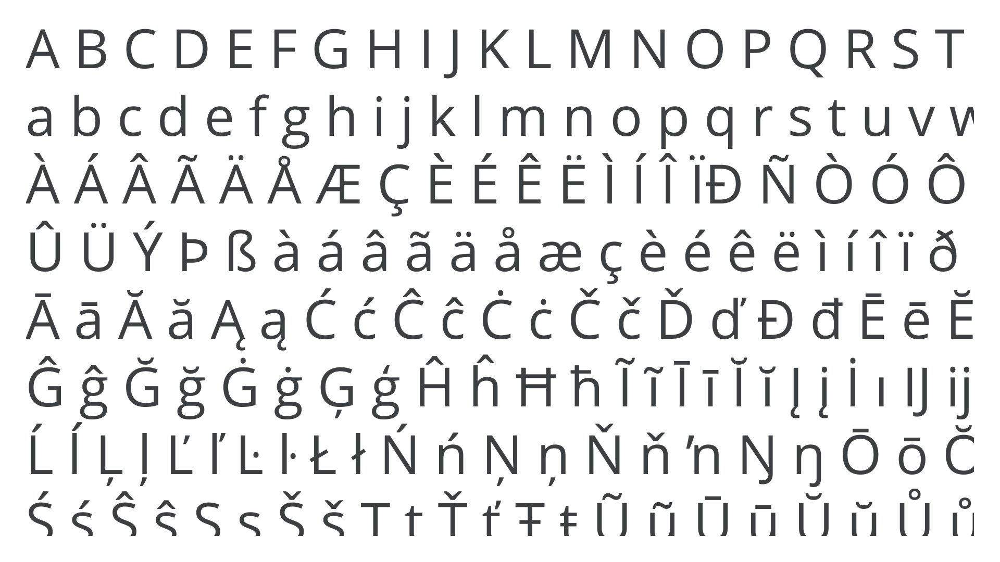

In typography, “Latin script” refers to the most widely adopted writing system in the world (and is also often used as a term to mean placeholder [copy](/glossary/text_copy)).

<figure>

</figure>

Roman inscriptions from the 6th century BC are the first recorded uses of the Latin alphabet, which itself was an adaptation (likely during the 7th century BC) of the Etruscan alphabet. The Y and Z characters were adopted from the Greek alphabet for borrowed Greek words, and additional characters were added over time.

The original version of the Latin alphabet contained only [uppercase](/glossary/uppercase_lowercase) forms. Lowercase letters were based on cursive handwriting. They were first used during the 1st century BC to the 3rd century AD as “Old Roman Cursive," before developing into “New Roman Cursive” from approximately the 3rd and 7th centuries AD.
