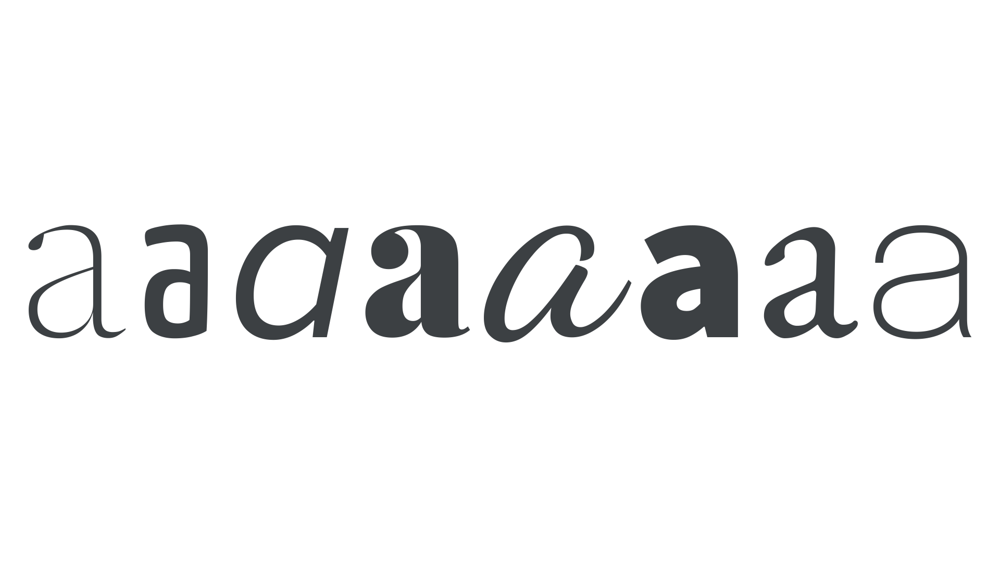

Letterform refers to the unique shape of a letter, with characteristics shared throughout a [typeface](/glossary/typeface) (or in [lettering](/glossary/lettering) and [calligraphy](/glossary/calligraphy)).

<figure>

</figure>

Analyzing letterforms means examining the components that make up the [characters](/glossary/character)—bowls, counters, stems, shoulders, etc.—as well as the proportions applied collectively to each [glyph](/glossary/glyph)—[x-height](/glossary/x_height), [cap height](/glossary/cap_height), [ascenders and descenders](/glossary/ascenders_descenders), etc.
