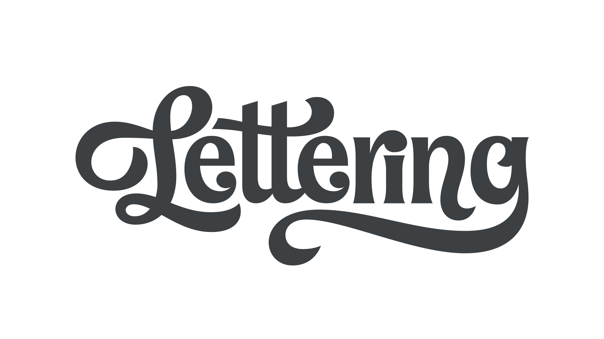

Lettering is the art of drawing letters rather than writing them, and is therefore distinct from [handwriting](/glossary/handwriting), [calligraphy](/glossary/calligraphy), and [typography](/glossary/typography).

<figure>

<figcaption>

Lettering by [Jessica Hische](https://www.jessicahische.is)
</figcaption>
</figure>

Although lettering is unlike typography in that no [characters](/glossary/character) are fixed, most lettering artists employ a uniform construction to their [letterforms](/glossary/letterform). With the use of [OpenType](/glossary/open_type) features such as [alternate characters](/glossary/alternates), typography can also sometimes resemble lettering. However, “true” lettering is created for a specific use case; i.e., a drawing of a particular word or phrase.
