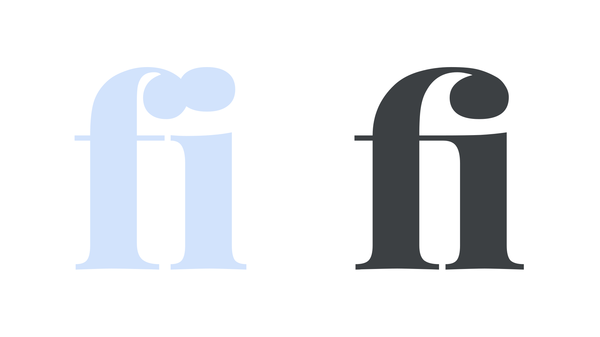

A ligature is a [glyph](/glossary/glyph) that combines the shapes of certain sequences of [characters](/glossary/character) into a new form that makes for a more harmonious [reading](/glossary/legibility_readability) experience. A common example is the “fi” ligature, which combines a lowercase “f” and a lowercase “i” into a single glyph so that the shoulder of the f doesn’t clash with the dot of the i.

<figure>

</figure>

Not all fonts contain ligatures and they won’t necessarily be visible by default. In some circumstances, such as in some desktop design apps, they’ll need to be turned on via [OpenType](/glossary/open_type) feature controls. On the web, default ligatures (`liga`) should work by default, but discretionary ligatures (`dlig`) need to be [activated manually](/lesson/implementing_open_type_features_on_the_web).

[Contextual alternates](/glossary/alternates) are related to ligatures in that they offer variations on a single character that might be more suitable to certain typographic contexts—for instance, if certain characters appear next to each other. The difference is that the individual glyphs change rather than two or more being replaced by a single glyph.