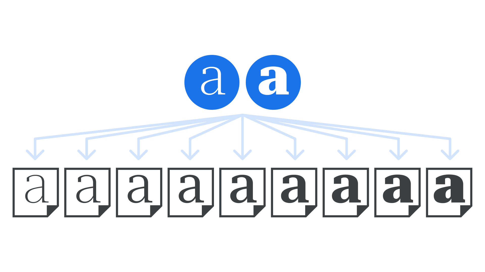

A master is a complete set of [glyphs](/glossary/glyph) designed in one particular [style](/glossary/style) within a [type family](/glossary/family_or_type_family_or_font_family). Often, several masters are designed to work together so that intermediate [weights](/glossary/weight) can be made automatically. For example, a Light master and a Bold master can be interpolated to generate a Regular weight.

Although it’s type designers who are most used to working with masters in font editing software, [variable fonts](/glossary/variable_fonts) have the masters embedded, and can generate intermediate instances on demand, according to requests from the end user.

<figure>

</figure>

It’s possible to create a typeface with many weights using two masters at the extreme ends—perhaps a master for the Hairline weight and a master for the Black weight—but, in practice, an extra master is often used to fine-tune the middle of the spectrum.

Generally speaking, the more instances desired (i.e. the greater the overall weight variation), the more masters are required.
