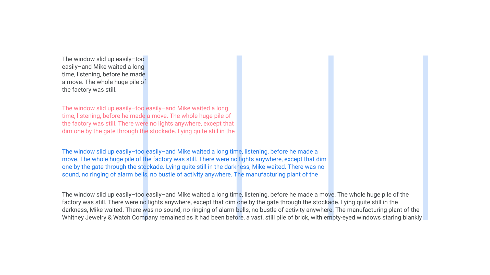

Measure is the name given to the length of a line of [text](/glossary/text_copy). In paragraph text, this is therefore also the assumed width of the whole text block.

<figure>

<figcaption>The first paragraph’s measure is very short, but suitable for micro-copy; the second is too short for standard paragraph text; the third is about right; the fourth is too long.</figcaption>

</figure>

Measure is an important factor in creating [readable](/glossary/legibility_readability) text. Lines that are too *narrow* disrupt the reading experience by forcing the reader to jump to a new line too often; lines that are too *wide* disrupt the reading experience by making it more difficult for the reader to effortlessly move their eye to the next line. This can result in lines being missed or repeated unnecessarily.

It’s also worth noting that changes to the measure should also influence [line height](/glossary/line_height_leading). Generally, longer lines need more generous line spacing.
