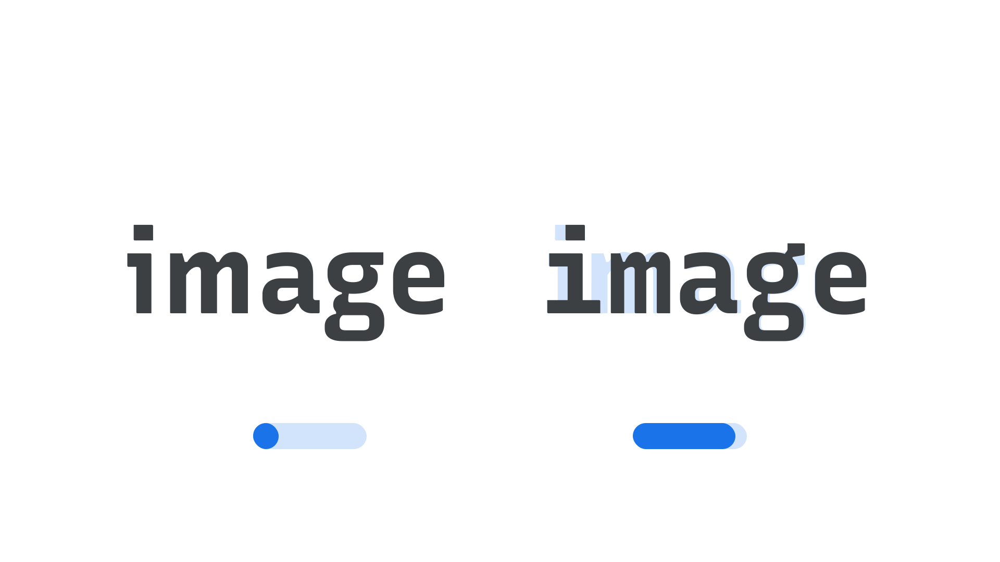

“Monospace” (MONO in CSS) is an axis found in some variable fonts, which adjusts the glyphs from a proportional width to a fixed width. In monospaced typefaces, or variable fonts set to a monospaced style, all glyphs take up the same amount of horizontal space. 

The [Google Fonts CSS v2 API ](https://developers.google.com/fonts/docs/css2) defines the axis as:

Default: 0     Min: 0     Max: 1     Step: 0.01

<figure>

<figcaption>CAPTION</figcaption>

</figure>

In line with the current CSS spec, all custom axes should be referenced in UPPERCASE (only the officially registered variable axes should appear in lowercase). Also, when using the Google Fonts API, the uppercase axes have to appear first in the URL.
