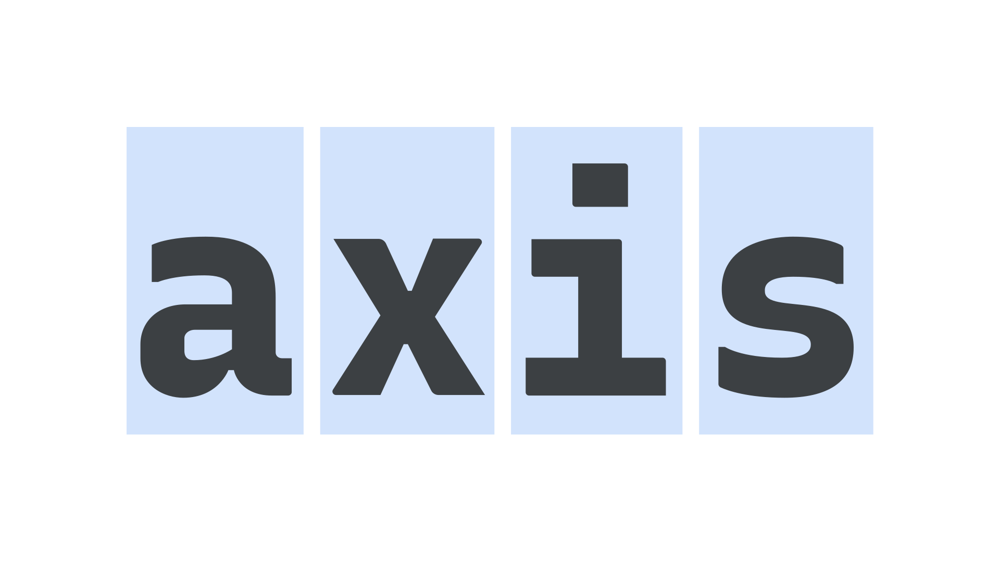

Monospaced [typefaces](/glossary/typeface) are ones in which all or most [characters](/glossary/character) take up the same amount of horizontal space. Code editors use monospaced typefaces by default.

<figure>

</figure>

As evidenced on any monospaced typeface (originally produced for typewriters), there are a number of common stylistic touches on common characters to account for this shared width, such as serifs on top of the stem on a lowercase “i,” or a heavily [condensed](/glossary/condensed_narrow_compressed) lowercase “m.”

Examples of monospaced typefaces include Courier, [Roboto Mono](https://fonts.google.com/specimen/Roboto+Mono), [Inconsolata](https://fonts.google.com/specimen/Inconsolata), [Source Code Pro](https://fonts.google.com/specimen/Source+Code+Pro), and [IBM Plex Mono](https://fonts.google.com/specimen/IBM+Plex+Mono).
