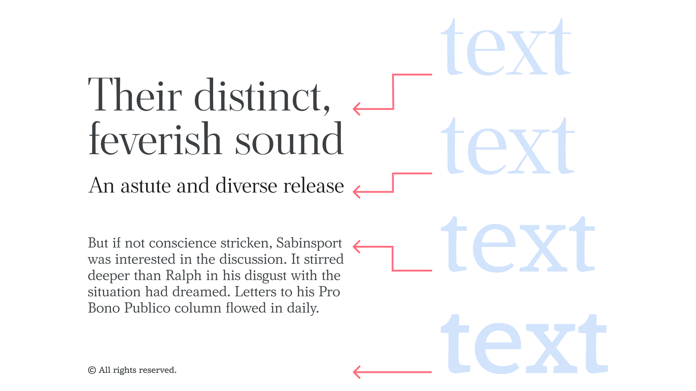

Optical sizes are different versions of a [typeface](/glossary/typeface) optimized for use at specific sizes or size ranges.

<figure>

<figcaption>On the left, text set in four different optical sizes—display, subhead, body, and caption—at the intended font sizes for each. On the right, all set at the same font size.</figcaption>

</figure>

Small (or [body](/glossary/body)) optical sizes tend to have:

- less stroke [contrast](/glossary/contrast),
- more open spacing,
- and taller [x-heights](/glossary/x_height)

than those of their large (or [display](/glossary/display)) counterparts. Different optical sizes can be split into separate [font](/glossary/font) files or be assigned to an [axis](/glossary/axis_in_variable_fonts) within a [variable font](/glossary/variable_fonts).
