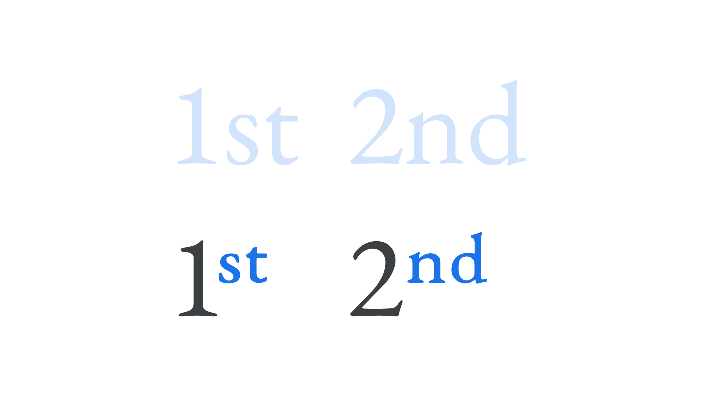

Ordinals are the small letters that appear next to a [numeral](/glossary/numeral). English examples include the “st” in “1st” (“first”), or “nd” in “2nd” (“second”).

In English, deciding whether to use ordinals is a matter of a publisher’s house style. In French and Spanish, usage is much more common.

<figure>

</figure>

In most [typefaces](/glossary/typeface), these [characters](/glossary/character) are not merely “shrunk” versions of their regular counterparts; they, like [small caps](/glossary/small_caps), are drawn and spaced to be in proportion to the rest of the [text](/glossary/text_copy), and can be activated by [OpenType](/glossary/open_type). In effect, they’re [optically sized](/glossary/optical_sizes).

Note that without the ordinal [glyphs](/glossary/glyph) present in the [font](/glossary/font), software may render them as [“faux” ordinals](/glossary/faux_fake_pseudo_synthesized).
