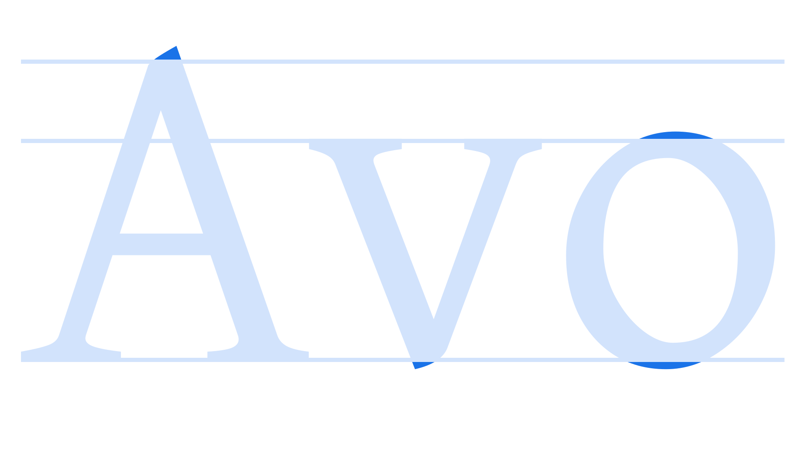

In [type design](/glossary/type_designer), an overshoot is the part of a [letterform](/glossary/letterform) that extends above or below the vertical dimensions of flatter [glyphs](/glossary/glyph). In the [Latin script](/glossary/latin), common [characters](/glossary/character) with overshoots incorporated into their design include the [lowercase](/glossary/uppercase_lowercase) “o”, which slightly extends above the [x-height](/glossary/x_height) and below the [baseline](/glossary/baseline), and the apex of the uppercase “A”, which extends above the [cap height](/glossary/cap_height).

The purpose of these overshoots is to create the optical illusion that all letterforms are aligned, whether their tops and bottoms are angled, curved, or flat. Without overshoots, our eyes interpret these characters as appearing shorter than the rest.

<figure>

</figure>

In practice, there are many elements of a [typeface](/glossary/typeface)’s design that could be considered overshoots, such as the cupped [serifs](/glossary/serif) present on some [old style](/glossary/humanist_old_style) serif typefaces.
