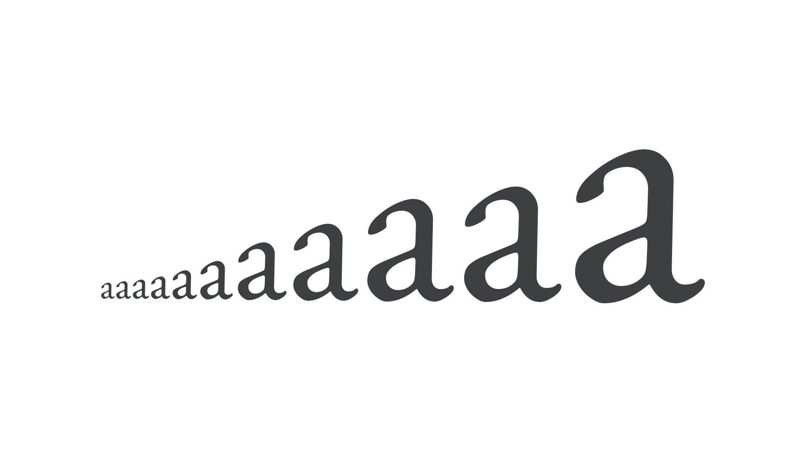

A point is a [unit](/glossary/unit) of measurement for [type](/glossary/type) and has been employed for hundreds of years. On the web, we tend to think of pixels, but in print design, points remain the standard unit of measuring [font](/glossary/font) size.

<figure>

</figure>

The original point measured 72.289 parts per inch, but has been rounded to simply 72 since the 1990s, in line with the 72 dpi (dots per inch) of the displays of the first Macintosh computers.
