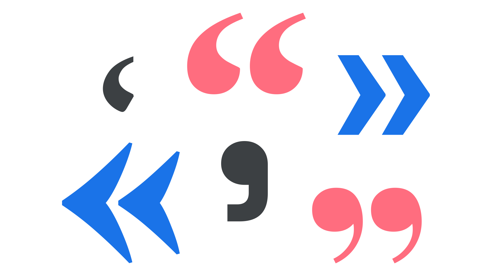

A quotation mark is form of punctuation with double and single variations, used to open and close a quotation accordingly.

<figure>

</figure>

Note that in British English, both single or double quotation marks can be used, depending on the conventions of the publication’s style guide. (If in doubt, use double marks for regular quotations and single marks for quotes-inside-quotes.)

- Spanish: guillemets; i.e., «Hamburgefonts» (in publishing; quotation marks in regular use)
- French, Russian, Portuguese, Turkish: guillemets, i.e., «Hamburgefonts»
- German: inverted quillemets; i.e., »Hamburgefonts«

Quotation marks should not be confused—as they very frequently are—with straight quotation marks, which are a hangover from the typewriter era. For this reason, quotation marks are sometimes called “curly quotes” or “typographer’s quotes.”

Content supplied for publishing will often use straight quotation marks (AKA “dumb quotes”), and a typographer should fix (or initiate processes to fix) such texts, or use an automatic system such as Frank Rausch’s [Typographizer](https://github.com/frankrausch/Typographizer).
