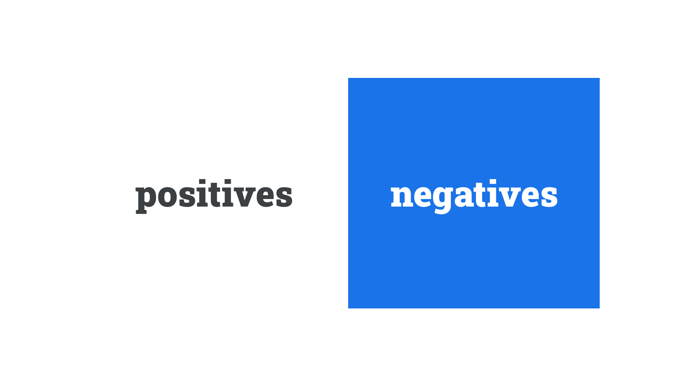

When white or light-colored [type](/glossary/type) is set on top of a black or dark-colored background, it’s said to be reversed-out. The term is derived from graphic design, where the white is usually the part of the paper without ink; the surrounding dark colours are the places where the ink lies.

<figure>

</figure>

Depending on the medium, this can have some side effects that are worth considering. In print, the darker ink may bleed into the white type, making the type appear less heavy than intended (and perhaps even missing some details, such as thin strokes in high-contrast typefaces). On screen, the reverse is true: Light type will appear to shine out from a dark background and will appear heavier. In physical signage, depending on the light source, letterforms may also appear bloated.

A way of counteracting these effects is to slightly increase or decrease the font weight (or grade). We detail this approach in our article, [“Exploring typefaces with multiple weights or grades.”](/lesson/exploring_typefaces_with_multiple_weights_or_grades)
