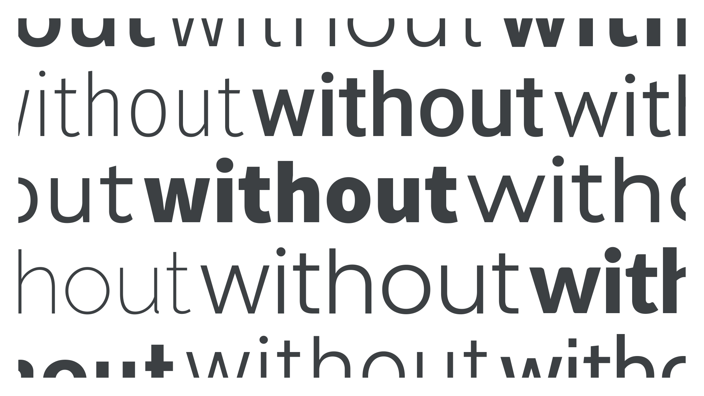

A sans serif—or simply “sans”—is a [typeface](/glossary/typeface) designed without [serifs](/glossary/serif) (from “sans”, the French word for “without”). Typically, sans serif faces have lower stroke [contrast](/glossary/contrast) and larger [x-heights](/glossary/x_height) than serifs.

<figure>

</figure>

There are many sub-genres of sans serif type. For a detailed look at [classifications](/glossary/classification) broken down by genre and historical period, please read our article: [“Making sense of typographic classifications.”](/lesson/making_sense_of_typographic_classifications)

Note that although not all characters naturally have serifs (such as an “o”), the classification applies to characters that *would* naturally have serifs (such as an “h”).

Examples of sans serif typefaces include [Roboto](https://fonts.google.com/specimen/Roboto?category=Sans+Serif), [Open Sans](https://fonts.google.com/specimen/Open+Sans?category=Sans+Serif), [Poppins](https://fonts.google.com/specimen/Poppins?category=Sans+Serif), [Noto Sans](https://fonts.google.com/specimen/Noto+Sans?category=Sans+Serif), [Work Sans](https://fonts.google.com/specimen/Work+Sans?category=Sans+Serif), and [Epilogue](https://fonts.google.com/specimen/Epilogue).
