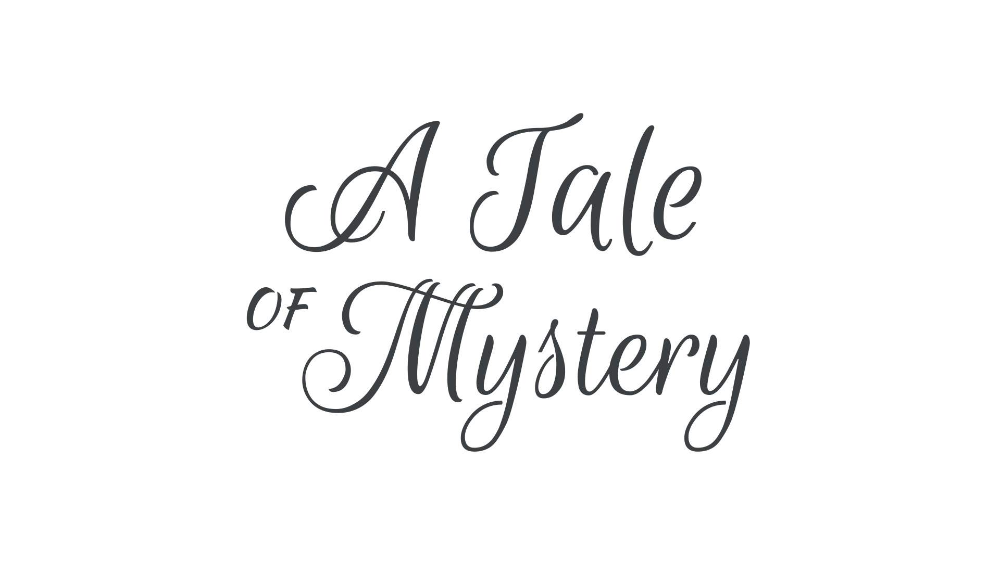

Script is a genre classification for [typefaces](/glossary/typeface) that take direct influence from [handwriting](/glossary/handwriting) and [calligraphy](/glossary/calligraphy). While there’s the potential for crossover with the “handwritten” sub-genre, most script [type](/glossary/type) is slightly more formal in its composition and is decorated with numerous flourishes.

<figure>

</figure>

[Swashes](/glossary/swash_glyph)—[alternate](/glossary/alternates) [glyphs](/glossary/glyph) that offer further decoration to [characters](/glossary/character)—are a common feature of script faces.

Examples of script typefaces include [Dancing Script](https://fonts.google.com/specimen/Dancing+Script?category=Handwriting), [Mr Dafoe](https://fonts.google.com/specimen/Mr+Dafoe?category=Handwriting&query=Sudtipos#standard-styles), [Parisienne](https://fonts.google.com/specimen/Parisienne), and Lobster.
