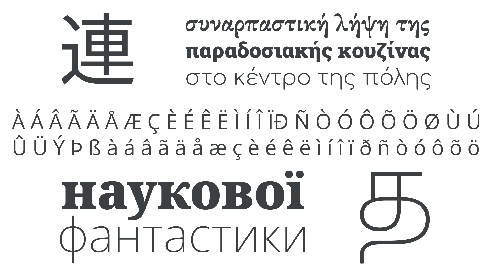

A script is a collective way of describing a writing system used by multiple languages (and shouldn’t be confused with the [“script” classification](/glossary/script_typeface_style) of [typefaces](/glossary/typeface)). For instance, although English, French, German, Norwegian, and Portuguese are distinct languages—with their own alphabets, conventions, and [diacritic](/glossary/diacritic_accent_marks) usage—they all use the [Latin](/glossary/latin) script.

<figure>

</figure>

Other writing systems include [Greek](/glossary/greek_script) (upon which Latin is based), [Cyrillic](/glossary/cyrillic) (originally based on uppercase Greek forms), Arabic, Korean, Indic scripts South and South East Asia, Han characters, and the traditional scripts of Africa.

The combination of a script and a set of conventions for a particular language is referred to as an orthography.
