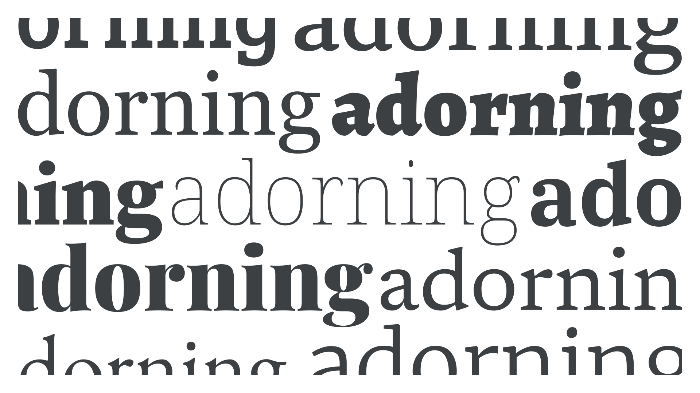

“Serif” refers to either the mark or line that can sometimes appear at the end of a [character](/glossary/character)’s [stroke](/glossary/stroke), or the collective name for [typefaces](/glossary/typeface) that use serifs in their design.

<figure>

</figure>

We often refer to serif typefaces simply as “serifs,” but really we’re describing a serif typeface with a design that uses serifs in its [letterforms](/glossary/letterform). There are many sub-genres of serif type. For a detailed look at [classifications](/glossary/classification) broken down by genre and historical period, please read our article, [“Making sense of typographic classifications.”](/lesson/making_sense_of_typographic_classifications)

Examples of serif typefaces include [EB Garamond](https://fonts.google.com/specimen/EB+Garamond?sort=popularity&category=Serif), [Merriweather](https://fonts.google.com/specimen/Merriweather?sort=popularity&category=Serif), [Noto Serif](https://fonts.google.com/specimen/Noto+Serif?sort=popularity&category=Serif), [Source Serif Pro](https://fonts.google.com/specimen/Source+Serif+Pro?sort=popularity&category=Serif), and [Alegreya](https://fonts.google.com/specimen/Alegreya?sort=popularity&category=Serif).
