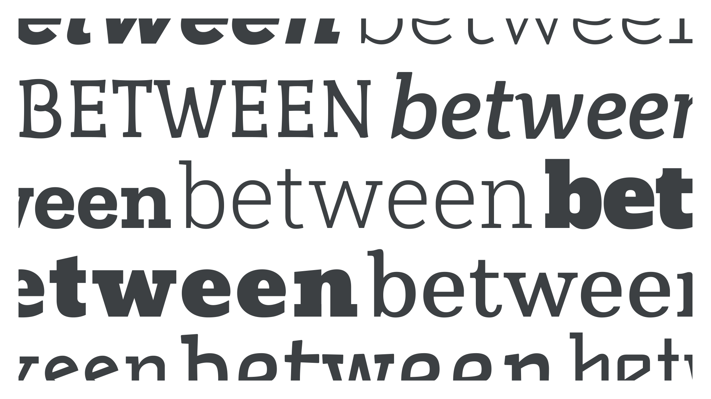

Slab serif—also called Egyptian, Clarendon, or simply “slab”—is a group of [typefaces](/glossary/typeface) close to [sans serifs](/glossary/sans_serif) in their construction, including their generally low [stroke](/glossary/stroke) [contrast](/glossary/contrast), but possessing [serifs](/glossary/serif) that match the overall stroke.

<figure>

</figure>

“Slab Serif” walks an interesting line between being another historical [classification](/glossary/classification) and a wider genre of typefaces, arguably on par with both serif and sans serif. And don’t be fooled by its name: Most slabs are closer to sans serifs than serifs, usually with a relatively [monolinear](/glossary/monolinear) or unmodulated stroke. In [superfamilies](/glossary/superfamily) that contain serifs, sans serifs, and slab serifs, you’ll often notice that the skeletal structure of the sans and slab is far closer.

The sub-genre of Clarendons is perhaps an exception, where there’s a smoother flow from the letterforms into the slabs themselves, and more overall contrast in the strokes.

There are many sub-genres of slab serif type. For a detailed look at classifications broken down by genre and historical period, please read our article: [“Making sense of typographic classifications”.](/lesson/making_sense_of_typographic_classifications)

Examples of slab serif typefaces include [Roboto Slab](https://fonts.google.com/specimen/Roboto+Slab?query=slab), [Crete Round](https://fonts.google.com/specimen/Crete+Round?query=Crete+Round), [Ultra](https://fonts.google.com/specimen/Ultra?query=ultra), and [Josefin Slab](https://fonts.google.com/specimen/Josefin+Slab?category=Serif&query=slab).
