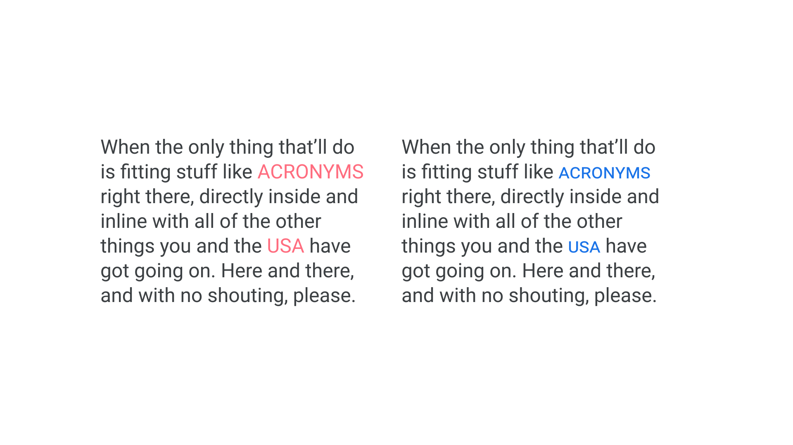

Small caps are just that: They’re small, uppercase [letterforms](/glossary/letterform) designed to sit alongside lowercase [type](/glossary/type). This results in the small-caps type appearing to be a more natural part of the [text](/glossary/text_copy).

[All-caps](/glossary/all_caps) text can often be hard to read and “shouts” out at the reader; small caps, by contrast, feel like a more natural part of the text. Small caps are typically slightly larger than the [typeface](/glossary/typeface)’s [x-height](/glossary/x_height).

<figure>

</figure>

When using small caps, we should employ them for three or more characters of capitalized text. For instance, there’s usually no need to set something like “US” in small caps, but a longer acronym, such as “UNESCO” will probably look better if more inline with the paragraph type. It’s usually advisable to add extra [tracking](/glossary/tracking_letter_spacing) to uppercase text, too.

If using [faux small caps](/glossary/faux_fake_pseudo_synthesized)—capitals artificially reduced in size—the small caps will look too light, hence the need for small caps that are designed for specifically that purpose.
