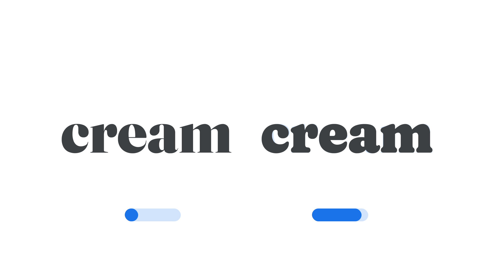

“Softness” (SOFT in CSS)  is an axis found in some variable fonts. At the end of this axis, letterforms become more soft and rounded.

The Google Fonts CSS v2 API defines the axis as:

Default: 0     Min: 0     Max: 100     Step: 0.01

In the Fraunces typeface, the softness axis can turn the sharpness and high-contrast serifs into bubble-like forms, and at its softest, the typeface starts to resemble the style of typefaces such as Souvenir or Bookman.

<figure>

<figcaption>CAPTION</figcaption>

</figure>

In line with the current CSS spec, all custom axes should be referenced in UPPERCASE (only the officially registered variable axes should appear in lowercase). Also, when using the Google Fonts API, the uppercase axes have to appear first in the URL.
