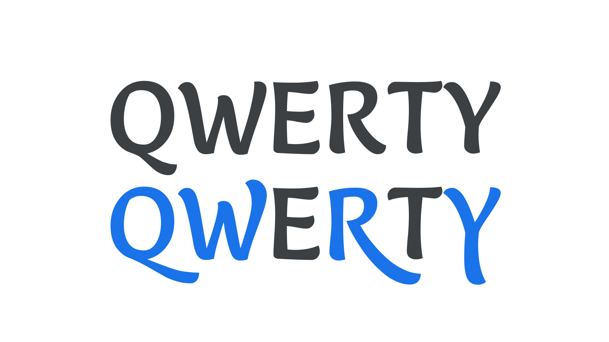

A swash [glyph](/glossary/glyph) is a decorative, [alternate](/glossary/alternates) variant, most commonly found in [serif](/glossary/serif) and [script](/glossary/script_typeface_style) [typefaces](/glossary/typeface). Such glyphs have more elaborate and ornate flourishes—such as actual swashes—than their regular versions.

<figure>

</figure>

Because of the extra space often taken up by swashes, special attention should be paid to where they appear in a word. Often, their most suitable location is at the beginning or end of a word (for this reason, swash capitals are intended only for the beginning of capitalized words), and a common mistake made by novice [typographers](/glossary/typographer) is to use swash characters that cause an undesirable collision between letterforms.

<figure>

<figcaption>The first line is incorrect, as the swashes on the “E” in the middle of each word clash with the letters in front of them; the second line, using swashes only for the first characters of each word, looks much better.</figcaption>

</figure>

Expertly coded fonts with swash glyphs have built-in rules that avoid such clashes, while fonts of a lesser quality are more likely to have them.

Swashes—if they exist in the [font](/glossary/font) file—can be turned on and off via [OpenType](/glossary/open_type).
