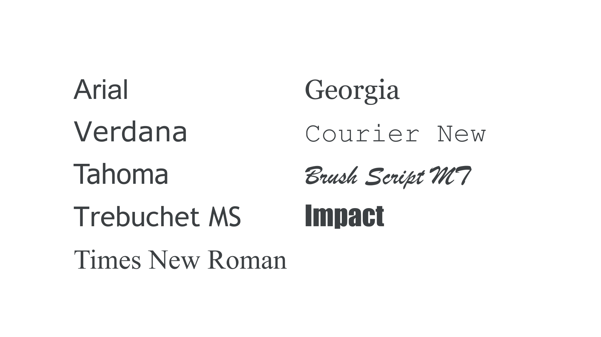

A system [font](/glossary/font) or web-safe font is one that’s already assumed to be on the vast majority of users’ devices, with no need for a [web font](/glossary/web_font) to be downloaded.

<figure>

</figure>

Prior to the arrival and widespread adoption of web fonts, web designers were limited to using [typefaces](/glossary/typeface) in their designs that would render as intended on all users’ computers—and the only way this could be assured would be to use fonts that were installed across the major operating systems of the world. In practice, this meant a small overlap between the fonts installed by default on Apple Macs, Windows-powered PCs, and Linux systems.

In certain settings, system fonts are still employed as the sensible default, such as in word processing apps that generate documents that will need to be edited on other users’ computers. It’s possible in CSS to invoke system UI fonts in web pages: `font-family: system-ui` results in Segoe on Windows, San Francisco on macOS, and Roboto on Android.
