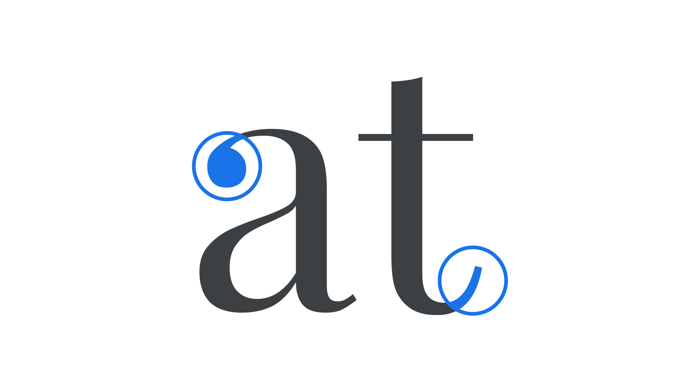

In type design, a terminal refers to the ending of the [stroke](/glossary/stroke). The way a [type designer](/glossary/type_designer) treats terminals is a key factor in the overall [typeface](/glossary/typeface) design, and has significant effects on [legibility](/glossary/legibility_readability) as well as stylistic expression.

<figure>

</figure>

Terminals come in many forms, such as the single-[serifs](/glossary/serif) on the top and bottom bar of an uppercase “E,” double-serifs on the middle bar of the “E,” balls on a lowercase “a,” flared serifs (where the serif is wider than the stem), or virtually any shape a stroke ends with—whether serifed or not.
