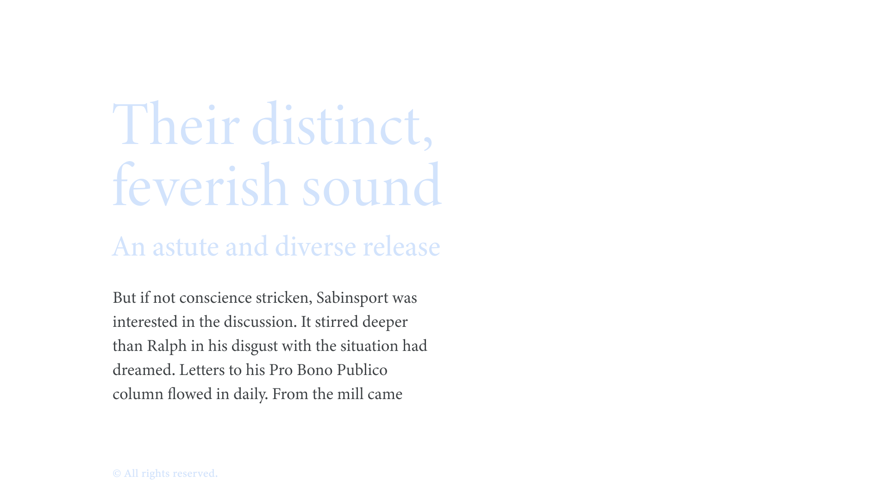

Text or copy is the content itself—the thing we [set](/glossary/typesetting) in [type](/glossary/type). We often use the term in distinction to headings, captions, pull quotes, and other textual matter of the piece. However, the word “text” can also imply the text [optical size](/glossary/optical_sizes) (or simply a small size), which is then interchangeable with the term “[body](/glossary/body).”

<figure>

</figure>

It’s impossible to talk about [type](/glossary/type) without also talking about text. The act of setting type means we end up with text on a page, whether physical or digital. Writers, editors, and proofreaders often call this copy.

If referring to the *size* of the type (optical or not), text or body sizes are assumed to be small—given that it’s a reference to the size of the main text on the page—and so emphasis is placed on the [readability](/glossary/legibility_readability) of type at these so-called “text” sizes.

On the web, it’s useful to establish the text size at `:root` in order to define other type sizes (headings, captions, etc.) in relation to it.
